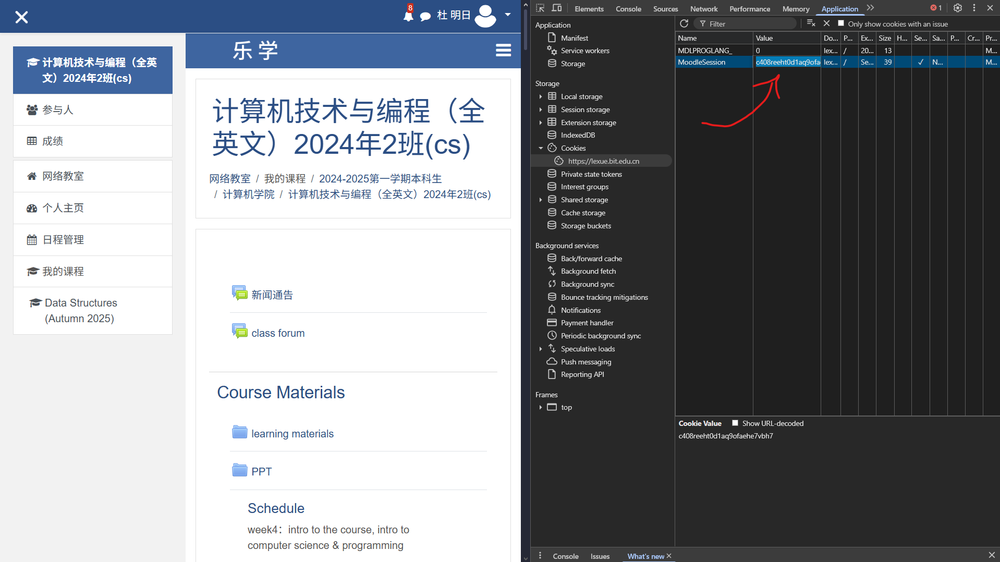

# lexue-cli: A Rust-based Lexue Command Line Interface

## Overview
`lexue-cli` is a command line interface (CLI) tool written in Rust that allows users to interact with the Lexue platform, which is used by Beijing Institute of Technology to distribute materials and assignments to students. 

## Purpose

Currently, lexue-cli is developed as a tool to tackle Lexue's programming exercises more efficiently


*A typical Lexue programming exercise ^*

## User flow 
### Step 1: Log in 
When the user run this command (This doesn't work yet :C, use `lexue-cli set-cookie` instead)
```bash
lexue-cli login
```
lexue-cli will pop out a browser page with the Lexue login page. (Technical jargons jumpscare warning) After logging in, the CLI will capture the CAS ticket sent by the log in page, which will be redeemed for the MoodleSession cookie, which will keep our CLI "logged in".

If the login doesn't work (which it doesn't work yet yeah), users can set the MoodleSession cookie themselves with this command.
```bash
lexue-cli set-cookie <cookie>
```
The cookie can be found using the following steps:
- Go to https://lexue.bit.edu.cn
- Log in to your school account
- Right click -> Inspect Element -> Application -> Cookies -> https://lexue.bit.edu.cn
- The MoodleSession cookie can be found here


Similar to the Lexue experience, you'll have to do this quite a lot.

### Step 2: Fetch the programming exercise
When user runs
```bash
lexue-cli fetch <exercise-id>
```
The CLI will create a folder in your system, which looks like this:
```
/<Question title>
    main.c          // You write your code here
    README.md       // The question's description will be parsed into this file
    lexue.toml      // Contains configurations for the cli to work
```

### Step 3: Submit
Finally, the question can be submitted using:
```bash
lexue-cli submit
```